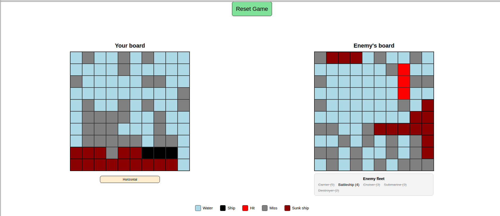

# 🚢 Battleship Game (TDD Project)

A fully functional implementation of the classic **Battleship** game, built using **Test Driven Development (TDD)** principles with **JavaScript**, **Jest**, and modular design.

This project focuses on clean architecture, separation of concerns, and testing core game logic without relying on the DOM.

---



---

## 📌 Features

* ✅ Ship creation with hit tracking and sunk status
* ✅ Gameboard system with ship placement and attack handling
* ✅ Player vs Computer gameplay
* ✅ Turn-based mechanics
* ✅ Random AI attacks (no duplicate moves)
* ✅ Win condition detection
* ✅ DOM rendering separated from logic
* ✅ Fully tested core logic using Jest

---

## 🧠 Concepts Practiced

* Test Driven Development (TDD)
* Unit Testing with Jest
* ES Modules (ESM)
* Object-Oriented / Factory Patterns
* Separation of Concerns (Logic vs UI)
* Event-driven programming

---

## 🏗️ Project Structure

```
src/
│
├── ship.js           # Ship factory/class
├── gameboard.js      # Gameboard logic
├── player.js         # Player logic (human + computer)
├── gameController.js # Controls game flow & turns
├── dom.js            # DOM manipulation & rendering
├── index.js          # Entry point
│
tests/
├── ship.test.js
├── gameboard.test.js
├── player.test.js
```

---

## 🚀 Getting Started

### 1. Clone the repository

```bash
git clone https://github.com/your-username/battleship.git
cd battleship
```

### 2. Install dependencies

```bash
npm install
```

### 3. Run tests

```bash
npm test
```

### 4. Run the project (development)

```bash
npm run dev
```

---

## 🧪 Testing

This project follows **Test Driven Development**:

* Write a test first
* Implement the feature
* Refactor

### Tested Modules

* **Ship**

  * `hit()`
  * `isSunk()`

* **Gameboard**

  * Ship placement
  * Attack handling
  * Miss tracking
  * All ships sunk check

* **Player**

  * Human vs Computer behavior
  * Valid attack generation

---

## 🎮 How to Play

1. The game initializes with predefined ship placements
2. The player attacks by clicking a cell on the enemy board
3. The computer responds with a random valid attack
4. The game continues turn-by-turn
5. First player to sink all enemy ships wins

---

## ⚙️ Game Logic Overview

### Ship

* Has a length
* Tracks number of hits
* Determines if sunk

### Gameboard

* Stores ship positions
* Receives attacks
* Tracks hits & misses

### Player

* Owns a gameboard
* Can be human or computer
* Computer generates random valid moves

### Game Controller

* Manages turns
* Ends game when all ships are sunk

---

## 🧩 Future Improvements

* Drag & drop ship placement
* Smarter AI (target adjacent cells after hit)
* Two-player local mode
* Animations & improved UI
* Mobile responsiveness

---

## 📚 Acknowledgements

* Built as part of **The Odin Project** curriculum
* Inspired by the classic Battleship board game

---

## 📄 License

This project is open source and available under the MIT License.
